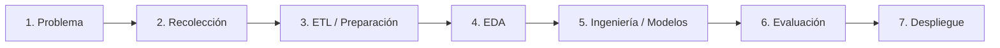

# PredictivoEdu - Dashboard Predictivo de Desempeño Académico

Este repositorio contiene un sistema de analítica y modelado predictivo del rendimiento escolar diseñado bajo la metodología **CRISP-ML** y el **ciclo de vida de Machine Learning (ML)**. Utiliza datos históricos (2015-2024) para estimar calificaciones promedio finales y clasificar el riesgo de no promoción escolar.

[](https://www.python.org/)
[](https://predictivoedu.streamlit.app/)
[](https://github.com/jhoansystem/predictivo_edu/blob/main/LICENSE)
[](https://github.com/jhoansystem/predictivo_edu.git)

---

## 🚀 Enlaces de Despliegue

*   **Aplicación Web (Streamlit)**: [https://predictivoedu.streamlit.app/](https://predictivoedu.streamlit.app/)
*   **Código de Repositorio (GitHub)**: [https://github.com/jhoansystem/predictivo_edu.git](https://github.com/jhoansystem/predictivo_edu.git)

---

## 🔄 Ciclo de Vida del ML & Metodología CRISP-ML

El proyecto sigue rigurosamente las etapas estándar del modelado predictivo:



### 1. Identificación del Problema
Se identificó la necesidad de contar con sistemas de alerta temprana en colegios para prevenir la deserción y reprobación escolar. El objetivo es predecir la nota final promedio de los estudiantes y su probabilidad de promoción.

### 2. Recolección de Datos
El dataset de partida `Resultados2015-2024.csv` cuenta con más de **840,000 registros transaccionales** representando las notas de los alumnos por asignaturas y periodos a lo largo de 10 años.

### 3. Preparación de Datos (ETL)
*   *Cuaderno*: `etl.ipynb`
*   *Acción*: Corrección del delimitador (`;`), eliminación de registros duplicados y corruptos (incluyendo errores de columnas desplazadas).
*   *Asignaturas*: Normalización de codificación de caracteres en `nommat` (remoción de caracteres corruptos en asignaturas como Matemáticas o Educación Física).
*   *Reducción*: Agregación a nivel **Estudiante-Año** para optimizar la velocidad y el consumo de RAM en la nube, resultando en el dataset limpio `resultados_estudiantes.csv`.

### 4. Análisis Exploratorio de Datos (EDA)
*   *Cuaderno*: `eda.ipynb`
*   *Acción*: Visualización de distribuciones de notas, boxplots para analizar la dispersión de notas entre promovidos y no promovidos, gráficos de barras de deserción histórica y matriz de correlación de variables numéricas.

### 5. Ingeniería de Modelos
*   *Cuaderno*: `modelado.ipynb`
*   *Acción*:
    *   **Regresión Lineal Múltiple**: Estima la nota promedio final basándose en el nivel del grado, inasistencias y clases de refuerzo.
    *   **Regresión Logística**: Clasifica si el alumno será promovido (1) o reprobado (0) en función de sus calificaciones promedio y cantidad de materias perdidas.

### 6. Evaluación del Modelo
*   **Regresión Lineal**: Evaluada mediante Error Cuadrático Medio (MSE), RMSE y Coeficiente de Determinación ($R^2$).
*   **Regresión Logística**: Evaluada usando Exactitud (Accuracy), Precisión, Sensibilidad (Recall), F1-Score y área bajo la curva ROC (ROC-AUC).

### 7. Despliegue, Mantenimiento y Actualización
*   El modelo y los escaladores estandarizados se exportan usando `joblib`.
*   Se despliega una aplicación web interactiva en **Streamlit** (`app.py`) junto con una Landing Page estática (`index.html`) para consulta pública.

---

## 📁 Estructura del Repositorio

```
├── Resultados2015-2024.csv     # Dataset crudo original (85.5 MB)
├── resultados_limpios.csv      # Dataset limpio transaccional
├── resultados_estudiantes.csv  # Dataset limpio agregado por estudiante-año
├── etl.ipynb                   # Cuaderno interactivo explicativo del ETL
├── eda.ipynb                   # Cuaderno interactivo explicativo del EDA
├── modelado.ipynb              # Cuaderno interactivo del entrenamiento de modelos
├── modelo_lineal.joblib        # Artefacto del modelo de Regresión Lineal
├── modelo_logistico.joblib     # Artefacto del modelo de Regresión Logística
├── scaler_lineal.joblib        # Escalador StandardScaler para Regresión Lineal
├── scaler_logistico.joblib    # Escalador StandardScaler para Regresión Logística
├── app.py                      # Código de la aplicación Streamlit
├── index.html                  # Landing Page explicativa del proyecto
├── requirements.txt            # Dependencias del proyecto
└── README.md                   # Documentación principal (este archivo)
```

---

## 🛠️ Ejecución Local

### Requisitos Previos
*   Python 3.9, 3.10 o 3.11.

### Pasos de Instalación
1.  Clonar el repositorio:
    ```bash
    git clone https://github.com/jhoansystem/predictivo_edu.git
    cd predictivo_edu
    ```
2.  Instalar las dependencias necesarias:
    ```bash
    pip install -r requirements.txt
    ```
3.  Ejecutar la aplicación Streamlit:
    ```bash
    streamlit run app.py
    ```
4.  Para visualizar la Landing Page, abre `index.html` en cualquier navegador web.
