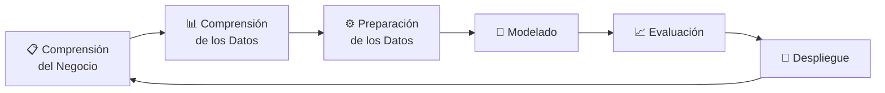

---

# 🏫 Sistema de Alerta Temprana Académica basado en Machine Learning

## 📋 Descripción

Sistema predictivo basado en **Machine Learning** diseñado para identificar estudiantes en riesgo de fracaso académico en la educación secundaria colombiana (grados 6° a 11°). El proyecto utiliza **10 años de datos históricos (2015-2024)** provenientes de una institución educativa colombiana para construir modelos que permiten anticipar el desempeño académico de los estudiantes.

### 🎯 Objetivo Principal

> **Predecir si un estudiante Aprueba o No Aprueba el ciclo académico**, permitiendo a docentes y directivos implementar intervenciones pedagógicas oportunas antes de que sea demasiado tarde.

### 📐 Metodología y Normativa

| Aspecto | Detalle |
|---------|---------|
| **Metodología** | CRISP-ML (Cross-Industry Standard Process for Machine Learning) |
| **Normativa** | SIEE – Sistema Institucional de Evaluación de Estudiantes (Colombia) |
| **Datos** | Registros académicos reales de 2015 a 2024 |
| **Alcance** | Educación secundaria colombiana (grados 6° - 11°) |

---

## 📁 Estructura del Proyecto

```
PROYfINAL/
├── 01-SISTEMA DE ALERTA ACADÉMICA_ETL.ipynb      # 📓 Cuaderno 1: Extracción, Transformación y Carga
├── 02-SISTEMA DE ALERTA ACADÉMICA_EDA.ipynb      # 📊 Cuaderno 2: Análisis Exploratorio de Datos
├── 03-SISTEMA_DE_ALERTA_ACADEMICA_MODELADO.ipynb # 🤖 Cuaderno 3: Modelado de Machine Learning
├── app.py                                         # 🚀 Aplicación interactiva Streamlit
├── index.html                                     # 🌐 Landing Page del proyecto
├── requirements.txt                               # 📦 Dependencias del proyecto
├── README.md                                      # 📖 Este archivo
├── preparar_datos_y_modelos.py                    # ⚙️ Script de preparación de datos y modelos
├── Resultados_2015-2024_limpio.csv                # 🗃️ Dataset limpio consolidado
├── dataset_modelos_aprendizaje.xlsx               # 📑 Datasets para modelos (Excel)
├── dataset_regresion_lineal.csv                   # 📄 Dataset para Regresión Lineal
├── dataset_regresion_logistica.csv                # 📄 Dataset para Regresión Logística
├── dataset_arboles_decision.csv                   # 📄 Dataset para Árboles de Decisión
└── modelos/                                       # 🧠 Modelos entrenados serializados
    ├── modelo_regresion_lineal.joblib
    ├── scaler_regresion_lineal.joblib
    ├── features_regresion_lineal.joblib
    ├── modelo_regresion_logistica.joblib
    ├── scaler_regresion_logistica.joblib
    ├── features_regresion_logistica.joblib
    ├── modelo_arbol_decision.joblib
    └── features_arbol_decision.joblib
```

---

## 🤖 Modelos Implementados y Métricas de Rendimiento

Evaluamos los tres modelos predictivos en el conjunto de prueba (20% de los datos) con las siguientes métricas reales obtenidas en el modelado:

| Modelo | Variable Objetivo | Tipo | Métricas de Evaluación |
| :--- | :--- | :--- | :--- |
| **Regresión Lineal** | `promedio_nota` | Regresión | **R²**: 0.9996 \| **MAE**: 0.0110 \| **RMSE**: 0.0190 |
| **Regresión Logística** | `promovido_bin` | Clasificación | **Accuracy**: 96.91% \| **Precision**: 98.22% \| **Recall**: 97.60% \| **F1-Score**: 97.91% \| **ROC-AUC**: 0.9890 |
| **Árbol de Decisión** | `promovido_bin` | Clasificación | **Accuracy**: 96.63% \| **Precision**: 98.96% \| **Recall**: 96.46% \| **F1-Score**: 97.70% \| **ROC-AUC**: 0.9793 |

### 📊 Flujo de Modelado

```
Datos Históricos ──► ETL ──► EDA ──► Feature Engineering ──► Entrenamiento ──► Evaluación ──► Despliegue
     (CSV)          (Limpieza)  (Análisis)   (Variables)        (Modelos)      (Métricas)    (Streamlit)
```

---

## 📐 Variables de los Modelos Consolidados

Los modelos de Machine Learning utilizan características agregadas a nivel estudiante-año, eliminando redundancias y enfocándose en la evaluación acumulativa anual:

| Variable | Tipo | Descripción |
| :--- | :--- | :--- |
| `grado` | Categórica | Grado escolar del estudiante (6° a 11°) |
| `promedio_nota` | Numérica | Promedio de notas general (0.0 a 5.0). *No usado en Regresión Lineal para evitar fuga de target.* |
| `intensidad_total_semanal` | Numérica | Horas de clase acumuladas por semana |
| `cantidad_asignaturas` | Numérica | Número total de asignaturas cursadas en el año |
| `total_faltas` | Numérica | Total de inasistencias acumuladas en el periodo anual |
| `porc_inasistencia` | Numérica | Porcentaje de fallas respecto a las horas totales de clase |
| `materias_perdidas` | Numérica | Cantidad de asignaturas reprobadas (nota inferior a 3.0) |
| `total_refuerzos` | Numérica | Sumatoria de actividades de refuerzo o recuperación presentadas |
| `nota_minima` | Numérica | Nota más baja obtenida en sus materias del año |
| `nota_maxima` | Numérica | Nota más alta obtenida en sus materias del año |
| `nota_std` | Numérica | Desviación estándar de sus calificaciones (mide regularidad) |
| `prom_X.` | Numérica | Promedio obtenido en la asignatura con código X (ej. matemáticas, español) |
| `promovido_bin` (Target) | Binaria | Variable a predecir: 1 = Promovido (Aprueba), 0 = No Promovido (Reprueba) |

---

## 🚀 Instalación y Uso

### Prerrequisitos

- **Python 3.11** instalado en el sistema
- **Git** para clonar el repositorio
- Conexión a internet (para instalar dependencias)

### Pasos de Instalación

```bash
# 1. Clonar el repositorio
git clone <url-del-repositorio>
cd PROYfINAL

# 2. Crear entorno virtual con Python 3.11
python -3.11 -m venv venv

# 3. Activar el entorno virtual
# Windows:
venv\Scripts\activate
# Linux/Mac:
source venv/bin/activate

# 4. Instalar dependencias
pip install -r requirements.txt

# 5. Ejecutar la aplicación Streamlit
streamlit run app.py
```

### 🎮 Uso Rápido

1. **Ejecutar** `streamlit run app.py` en la terminal
2. **Abrir** el navegador en `http://localhost:8501`
3. **Explorar** los tres módulos de predicción:
   - 🔢 **Regresión Lineal**: Predice el promedio numérico esperado
   - ✅ **Regresión Logística**: Predice la probabilidad de aprobación
   - 🌳 **Árbol de Decisión**: Clasifica al estudiante como aprobado o no aprobado
4. **Ingresar** los datos del estudiante en los formularios interactivos
5. **Obtener** la predicción con visualizaciones y recomendaciones

---

## ☁️ Despliegue

### Streamlit Cloud

La aplicación está disponible en línea a través de Streamlit Cloud:

🔗 **[Acceder a la Aplicación en Streamlit Cloud](#)** *(enlace próximamente)*

### GitHub Pages

La Landing Page del proyecto está desplegada en GitHub Pages:

🔗 **[Ver Landing Page](#)** *(enlace próximamente)*

### Instrucciones de Despliegue en Streamlit Cloud

1. Subir el repositorio a GitHub
2. Ir a [share.streamlit.io](https://share.streamlit.io)
3. Conectar con la cuenta de GitHub
4. Seleccionar el repositorio y el archivo `app.py`
5. Configurar Python 3.11 como versión del entorno
6. ¡Desplegar! 🚀

---

## 🛠️ Tecnologías Utilizadas

<p align="center">


</p>

---

## 📚 Proceso CRISP-ML

El proyecto sigue la metodología **CRISP-ML** (Cross-Industry Standard Process for Machine Learning):


```mermaid
graph LR
    A[📋 Comprensión<br>del Negocio] --> B[📊 Comprensión<br>de los Datos]
    B --> C[⚙️ Preparación<br>de los Datos]
    C --> D[🤖 Modelado]
    D --> E[📈 Evaluación]
    E --> F[🚀 Despliegue]
    F --> A
```

| Fase | Cuaderno / Archivo | Descripción |
|------|-------------------|-------------|
| **Comprensión del Negocio** | README.md | Definición del problema y objetivos |
| **Comprensión de los Datos** | Cuaderno 2 (EDA) | Análisis exploratorio y visualización |
| **Preparación de los Datos** | Cuaderno 1 (ETL) | Limpieza, transformación y carga |
| **Modelado** | Cuaderno 3 (Modelado) | Entrenamiento de modelos ML |
| **Evaluación** | Cuaderno 3 (Modelado) | Métricas de rendimiento |
| **Despliegue** | app.py + Streamlit Cloud | Aplicación web interactiva |

---

## 👥 Autores

**Talento Tech Colombia** — Bootcamp de Ciencia de Datos 2025

> 🇨🇴 Proyecto desarrollado como parte del programa **Talento Tech** del Ministerio de Tecnologías de la Información y las Comunicaciones de Colombia.

---

## 📄 Licencia

Este proyecto está licenciado bajo la **Licencia MIT**. Consulte el archivo [LICENSE](LICENSE) para más detalles.

```
MIT License

Copyright (c) 2025 Talento Tech Colombia

Se concede permiso, de forma gratuita, a cualquier persona que obtenga una copia
de este software y los archivos de documentación asociados (el "Software"), para
utilizar el Software sin restricción, incluyendo sin limitación los derechos a
usar, copiar, modificar, fusionar, publicar, distribuir, sublicenciar y/o vender
copias del Software, y a permitir a las personas a quienes se les proporcione el
Software a hacer lo mismo, sujeto a las siguientes condiciones:

El aviso de copyright anterior y este aviso de permiso se incluirán en todas las
copias o partes sustanciales del Software.

EL SOFTWARE SE PROPORCIONA "TAL CUAL", SIN GARANTÍA DE NINGÚN TIPO, EXPRESA O
IMPLÍCITA, INCLUYENDO PERO NO LIMITADO A LAS GARANTÍAS DE COMERCIABILIDAD,
IDONEIDAD PARA UN PROPÓSITO PARTICULAR Y NO INFRACCIÓN.
```

---

<p align="center">
  <b>🎓 Educación + 🤖 Inteligencia Artificial = 💡 Mejores Oportunidades</b>
  <br><br>
  <i>Hecho con ❤️ en Colombia 🇨🇴</i>
</p>
